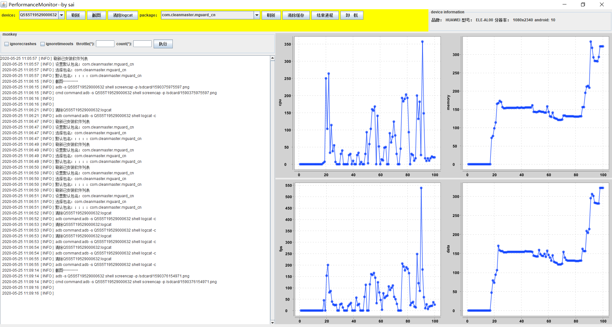

# 未完待续……
# android手机助手+性能监测
## 平台需求：

桌面级应用（可能是把，后边再说……），运行后桌面显示程序所有功能  
有刷新按钮，刷新后对device和package进行重置，device下拉框显示所有已连接设备，选择deviceis，显示设备信息、package下拉框显示所有已安装应用，选择package包名，就可以对该应用的性能指数进行监控
### 1.设备选择和刷新，包名选择和刷新（已完成）
显示设备列表，设备刷新按钮，logcat清除，截图抓取  
包名列表，包名刷新，清缓存，卸载
### 2.设备信息查看（已完成）
写页面的过程中，发现前端控件在一个类中初始化，有点乱，打算把设备信息的panel封装出来  
品牌，型号，分辨率，android版本
### 3.monkey测试（已完成）
点击执行monkey，进行monkey测试，实时打印日志  
如何做到实时日志获取并打印到前台？  
方法1：monkey命令执行结果输出到本地一个txt文件中，代码读取文件内容，实时打印  
我自己想出来的方法，并没有去写，仔细想一下就特么不好搞……txt一边读一边写，那不是搞死，哈哈  
方法2：执行cmd命令时，肯定需要流来读取结果的呀，把流返回来，直接将流输出到前台不就可以了，看来IO那块没白学  
具体见cmdtool类  
日志直接输出到log中显示（已完成）
~~~
adb -s deviceid shell monkey -p 包 -v -v -throttle 500 50
~~~
### 4.log显示（已完成）
log直接输出到文本区域，实时显示日志
### 5.性能测试（未完）
多线程应用  
通过adb实时监控device的性能，包括时间，内存，cpu，流量，fps  
每执行一次，获取一次性能参数，保存到对象中，每个对象组成一个list或数组  
将整体结果制作测试报告，extentreports框架  
20200427：好像我最初的想法和现在不一样了，最初是收集数据，最后统一输出做测试报告，现在想的是实时监控工具，让所有数据实时输出到前台，我擦，需求不一样实现上肯定也不一样啊，获取到的性能值还有必要存入对象集合吗？好像没必要……  
也没有必要去触发性能监控吧？只要打开程序，就一直跑一直抓数据输出到前台，这样才是监控嘛
#### 1.获取cpu命令行
adb shell dumpsys cpuinfo|findstr com.xstore.sevenfresh  
结果会有多行，因为一般app都有server服务进程  
~~~
  13% 16464/com.jingdong.app.mall: 9.2% user + 4% kernel / faults: 10176 minor 15 major
  0% 16924/com.jingdong.app.mall:jdpush: 0% user + 0% kernel / faults: 40 minor
  0% 17019/com.jingdong.app.mall:WatchDogService: 0% user + 0% kernel / faults: 3 minor
~~~
将结果进行字符串解析，获得第一行的13%即可  
华为手机使用此命令时有延迟，打开应用后，刚开始无法获取到cpu数据  
网上评论，cpuinfo是一段时间的平均值，受其他命令影响大，尤其是dumpsys meminfo,建议用top，并且top命令执行需要2-3s时间，建议使用busybox，通过搜索发现busybox需要root才可以，在手机上装bosybox工具，因此无法使用busybox，只用top即可，增加-d 0.5来设定执行时间0.5s，不知道是否管用，不管了，就这样吧  
使用top时，包名显示不全，华为手机，不知道其他手机是否如此,暂时使用自定义显示内容来解决  
~~~
adb -s Q5S5T19529000632 shell top -o ARGS -o %CPU -d 0.5|findstr com.jingdong.app.mall
~~~
由于此命令会一直输出，并不是一次请求就结束的，执行命令后，后边的代码不再执行了，无法获取到cpu值  
命令行中增加-n 1,只执行一次，这样会自动结束  
~~~
adb -s Q5S5T19529000632 shell top -o ARGS -o %CPU -d 0.5 -n 1|findstr com.jingdong.app.mall
~~~
这样成功获取cpu值  
此命令在华为手机上可以正常获取，oppo手机上获取不到……  
小米mix2没有-d，在此处-d无作用，可以直接去掉  
已适配：华为p30，小米mix2
#### 2.获取内存命令行
方法1：adb shell dumpsys meminfo com.jingdong.app.mall  
返回指定应用的内存情况，获取total值作为内存参数  
方法2：adb shell dumpsys meminfo|findstr Foreground  
返回当前应用的内存占用，好解析。但是无法确认当前应用，如果app闪退，抓到的是luncher的内存了  
使用方法1获取成功  
获取内存返回的是kb，数字太大，显示时有问题，需要去掉后三位
#### 3.获取fps
adb shell dumpsys gfxinfo com.xstore.sevenfresh
此指令会返回前120个fps数据，需要进行数据的处理才能得到实时的fps
#### 4.获取流量
方法：  
1.adb shell ps|findstr xxx获取应用的pid  
2.adb shell cat /proc/pid/net/dev | finstr wlan0  
此方法可以获取到pid的流量，但是当打开被测app后，流量立刻好几百，明显不是从0开始统计的，或者是没有清零
#### 5.获取打开时间

## 问题及解决方法
#### 1.写页面的时候遇到问题了：创建了deviceandpack类，用来存device和pack，一旦选择就赋值，但是每次用的时候都要初始化类，才可以调里面的get方法，初始化后前面赋值就没啦！get为null  
是不是new一个对象，对象的属性都是null？  
当然了，两个类中分别new一个对象，是两个不同的对象，对象属性可以分别进行赋值  
所以将device和package变为静态变量，可以不用new直接使用
又遇到了问题，deviceandpack类中有两个静态变量device和pack，在不同的时间对两个变量赋值，但是又不能new对象，如果new的话另一个值就没了  
我擦，我好像给自己整蒙圈了，new的对象只在当前类下有效啊，我定义的deviceandpack类并不是全局的static类，里面的device不能全局使用，static这块需要好好复习一下了  
通过实践证明，device和package设置为static后，new对象，他们的属性不会为null，所以上面遇到的问题理解错误  
cao!解决了，device和package实现了联动，并且选择后成功存入deviceandpack，后边都可以拿来用了
#### 2.个对象有两个属性a和b，要在某个地方对a赋值，在另外一个地方对b赋值，这咋弄？不能在两个地方new吧，那就是两个对象了
将a和b设为static静态方法，两个地方new对象，不会对a和b的值有影响，可以在两个地方分别new对象来进行a和b的set  
#### 3.JComboBox组件只有一个值时，监听不生效
itemlistener和actionlistener两个监听器，只有在改变的时候才会执行，当combobox只有一个值时，点击不会触发监听器，因此不会执行  
做一个combobox值得判断，当=1时直接进行赋值，>1时才会走监听器
#### 4.线程有返回值吗？可以再线程执行时返回数据吗？
线程有start和stop方法，线程执行过程中不能返回，如果需要返回线程执行结果，也是在stop后返回
#### 5.jlabel控件无法选中进行复制……
一天的时间，终于找到了答案，我的天……https://blog.csdn.net/m0_37874657/article/details/80536086  
先是按照上面说的，将src设置为sources，然后配置文件放在src根目录下！！！
#### 6.log4j日志输出到前端控件
https://www.iteye.com/blog/yshjava-1325036
#### 7.jcombobox控件的选择监听会执行两遍
正常情况下，监听会执行两遍，itemstate有两种状态，Selected 和 deSelected（即选中和未被选中），增加一个判断if (e.getStateChange() == e.SELECTED)，itemstate状态和是选中状态时执行。  
但是点击刷新按钮后，监听会执行四遍，很奇怪……刷新按钮只是把device下拉框重新初始化一遍，选择监听就会执行四遍，难道刷新不可以初始化？  
果然是不可以初始化，刷新时只要给下拉框内容重新赋值即可  
以上判断错误，代码中初始化并没有new对象，并不是初始化两次，而是添加监听的代码多次执行，刷新一次就会添加一次监听，刷新多次会添加多个监听，所以不能刷新时也添加监听，修改方式还是上面的方式  
#### 8.折线图xchart原理
实际上是将数据保存在list中，每新增一个值，折线图都是重绘制一次  
所以要实现横坐标显示一定的值，就要控制list的大小不变，然后有新数据添加时，把前面的数据删掉，和行车记录仪保存视频功能类似
#### 9.折线图实际是list数组作为数据，怎样保证list数量不变，插入数据后第一个数据删除？
list直接用remove就可以啊，list中值的顺序不会变，将list.remove(0)第一个数据删除，然后再add新的数据，就保证了list的size不变，添加一个后第一个数删除  
想太多就会乱，一个很简单的问题，都不能算做问题
#### 10.monkey按钮，如果执行次数很大时，按钮一直是down状态，无法进行其他操作
monkey执行不处理返回数据，只执行命令即可  
#### 11.ui布局为flowlayout时，总是随窗口大小改变，布局改变，改为相对坐标布局
可以获得屏幕大小，然后按照百分比来设置控件大小
可以设置jframe窗体大小不可变，setResizable(true)
控件可以随便摆放，叫坐标式布局